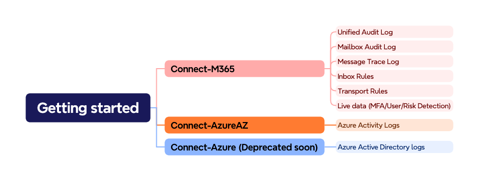

Installation
=======

Install the Microsoft-Extractor-Suite toolkit:
::

   Install-Module -Name Microsoft-Extractor-Suite

Install the Powershell module Microsoft.Graph for the Graph API functionalities:
::

   Install-Module -name Microsoft.Graph

Install the Powershell module ExchangeOnlineManagement for the Microsoft 365 functionalities:
::

   Install-Module -name ExchangeOnlineManagement

Install the Powershell module Az for the Azure Activity log functionality:
::

   Install-Module -name Az

Install the Powershell module AzureADPreview for the Entra ID functionalities:
::

   Install-Module -Name AzureADPreview

.. note::

   If you receive an error message indicating that the specified commands already exist on your system, you can resolve the issue by including the "-AllowClobber" parameter in the "Install-Module" command. This parameter will allow the installation process to overwrite any existing versions of the module and replace them with the newer version.

 
Getting Started
-------
To get started with the Microsoft Extractor Suite tool, make sure the requirements are met.

The first step is to import or install the Microsoft-Extractor-Suite.

To import the Microsoft-Extractor-Suite:
::

   Import-Module .\Microsoft-Extractor-Suite.psd1
   
To install the Microsoft-Extractor-Suite:
::

   Install-Module -Name Microsoft-Extractor-Suite

Additionally, you must sign-in to Microsoft 365 or Azure depending on your usage before Microsoft-Extractor-Suite functions are made available. We made a graphic to help you decide which Connect function you should use depening on what you wan to acquire. 

To sign in, use the following cmdlets:
::

   Connect-M365 or connect-exchangeonline
   Connect-Azure or Connect-AzureAD
   Connect-AzureAZ or Connect-AzAccount

